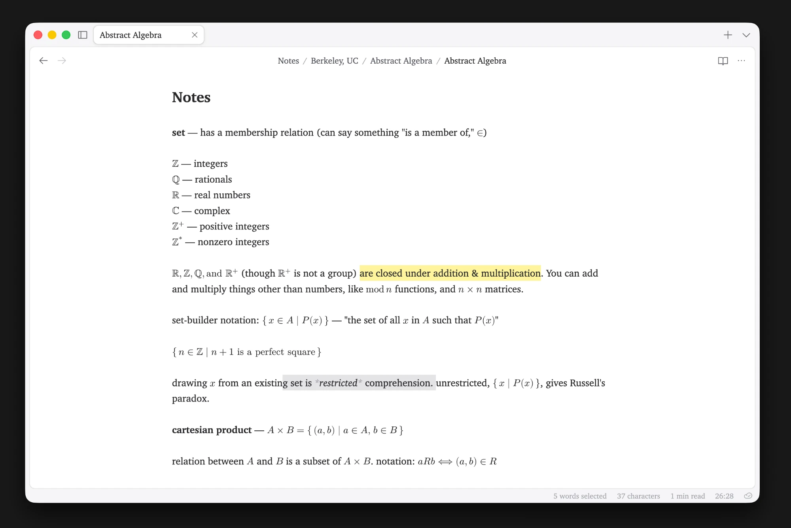

# Gasp

A fast, native Markdown editor for an Obsidian vault. It's written in Rust, runs on macOS, Windows and Linux with an iPhone app on the same core, syncs through GitHub, and every part of it can be changed through plain config files in the vault's `.gasp/` folder.

## Building

| Command | What it does |
|---|---|
| `make run` | Builds the desktop app and opens your last vault |
| `make dmg` | Builds a signed, notarized `Gasp-<version>.dmg` in `target/package/` |
| `make ios-phone` | Builds the iPhone app and installs it on a plugged-in iPhone |
| `make ios-sim` | Builds the iPhone app and runs it in the simulator, without opening its window |
| `make help` | Lists the rest |

`gasp mcp <vault>` serves a vault to MCP clients such as Claude.

[PLAN.md](PLAN.md) has the design and where each part stands.
